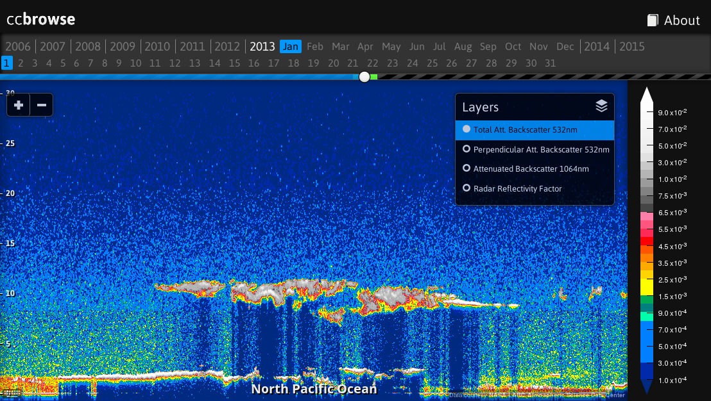

# ccbrowse

ccbrowse is an open source web application for browsing data from atmospheric
profiling satellites. In the current version, it supports importing two
datasets of the CALIPSO satellite, but new importing classes can be added as
needed. It is comprised of a web application and a backend for importing
various types of product files. An example ccbrowse deployment is available at
[browse.ccplot.org](http://browse.ccplot.org).



## Installation

ccbrowse can be installed on Linux (other operating systems are currently not
supported). On Debian-based distributions (e.g. Ubuntu and Devuan), install
system dependencies with:

```sh
apt-get install libhdf4-dev libhdfeos-dev libgeos-dev sqlite3 python3 python3-dev python3-setuptools cython3
```

To install ccbrowse:

```sh
pip3 install ccbrowse
```

Make sure that the directory `$HOME/.local/bin` is in the PATH environmental
variable.

## Setup

A new ccbrowse repository `repo` can be created with:

```sh
ccbrowse create repo
```

This will create a directory containing the profile specification and
directories where layers and cache will be stored. Next, you have to import
data to display. Download CALIPSO Level 1B product HDF files from [NASA
Earthdata](https://earthdata.nasa.gov). You can import the data files from
within the repository with:

```sh
cd repo
ccbrowse import calipso CAL_LID_L1-ValStage1-V3-01.2008-04-30T23-57-40ZN.hdf
```

Alternatively, to import only a certain layer or zoom level, use the `-l` or
`-z` options:

```sh
ccbrowse import -l calipso532 -z 2 calipso CAL_LID_L1-ValStage1-V3-01.2008-04-30T23-57-40ZN.hdf
```

This will generate tiles for the layer calipso532 and zoom level 2.

Finally, run the server with:

```sh
ccbrowse server
```

This will make ccbrowse available in a web browser at
[http://localhost:8080/](http://localhost:8080/).

If you encounter any issues, [file a bug report](https://github.com/peterkuma/ccbrowse/issues)
or post to the [mailing list](mailto:ccplot-general@lists.sourceforge.net).

## Running the server

By default, the server listens on localhost:8080 for incoming HTTP connections,
but you can change that by supplying an address and port as an argument, e.g.:

```sh
ccbrowse server 192.168.0.1:8000
```

To enable debugging mode, use the -d switch:

```
ccbrowse server -d
```

This will cause the server to respond with detailed messages should an
error occur.

Other command line options:

    -c CONFIG   configuration file (default: config.json)
    -s SERVER   server backend or "help" for a list of options (default: gunicorn)
    -w WORKERS  number of server backend workers (default: 10)

## Deployment

For a production deployment, it is recommended to start ccbrowse through
the operating system init system. Below is an example how to create a new
operating system user `ccbrowse`, install ccbrowse in this user's home
directory, and register a new system service to run ccbrowse on system start:

```sh
adduser --system --group --shell /bin/bash ccbrowse
mkdir /var/log/ccbrowse
chown ccbrowse:ccbrowse /var/log/ccbrowse
su - ccbrowse
pip3 install ccbrowse
~/.local/bin/ccbrowse create repo
cd repo
# Edit config.json. Change log to "/var/log/ccbrowse/error.log" and accesslog
# to "/var/log/ccbrowse/access.log".
exit

# For systemd based operating systems (e.g. Ubuntu or Debian):
cp ~ccbrowse/.local/lib/python*/site-packages/ccbrowse/init-scripts/systemd /etc/systemd/system/ccbrowse.service
systemctl enable ccbrowse.service
service ccbrowse start

# For init based operating systems (e.g. Devuan):
cp ~ccbrowse/.local/lib/python*/site-packages/ccbrowse/init-scripts/init /etc/init.d/ccbrowse
update-rc.d ccbrowse defaults
service ccbrowse start
```

To import data:

```sh
su - ccbrowse
cd repo
ccbrowse import ...
exit
service ccbrowse restart
```

In order to make ccbrowse available on a public domain, you can deploy an HTTP
server such as [nginx](http://nginx.org/), and use this example virtual server
configuration:

```
server {
        listen 80;
        listen [::]:80 default ipv6only=on;
        server_name your.domain;
        access_log  /var/log/nginx/ccbrowse.access.log;

        location / {
                proxy_pass http://localhost:8080;
                proxy_set_header Host $host;
                proxy_set_header X-Real-IP $remote_addr;
                proxy_set_header X-Forwarded-For $proxy_add_x_forwarded_for;
        }
}
```

replacing `your.domain` with the desired domain name.

## Repository

The ccbrowse repository is a directory that holds imported tiles, cache
and downloaded product files. Additionally, it contains information
necessary for performing operations on the repository,
such as the configuration file and profile specification. Here is a
list of files in a typical ccbrowse repository:

    cache               tile cache
    colormaps           custom colormaps
    layers              layer data
    products            raw product files
    config.json         repository configuration file
    profile.json        profile specification
    wsgi.py             WSGI module
    README              README file

When you fetch a product, it is downloaded into `products`, split
and interpolated into tiles of 256x256px and saved in `layers`. When tiles
are requested from the server, a chosen colormap is applied on them,
and the resulting images are saved in `cache`.

How tiles and images are stored is configurable. By default, tiles
are stored in a number of SQLite databases, sharded (split) by the x-coordinate,
in order to avoid overly large database files and large number of files
in file system directories. Images are stored in SQLite databases
sharded by hashing, and automatically resharded to maintain
database files of a suitable size. This should allow the repository
to grow to terabytes of data and millions of tiles, as is necessitated by the
vast amount of satellite recordings available.

Other options of storage include filesystem storage, when each tile
is stored as a standalone file. This is suitable for testing purposes,
but does not scale to more that several product files with typical file systems.

## Configuration

The repository configuration is defined in `config.json`, e.g.:

    "server": "gunicorn",
    "workers": 10,
    "log": null,
    "loglevel": "info",
    "accesslog": null,
    "host": "localhost",
    "port": 8080,
    "debug": false,
    "providers": {
        "echo": {
            "login": "",
            "password": ""
        }
    },
    "profile": "profile.json",
    "colormaps": "colormaps",
    "cache": {
        "driver": "htree",
        [...]
    }
    "storage": [
        {
            "requires": ["layer", "zoom", "x", "z"],
            "driver": "sqlite",
            [...]
        },
        [...]
    ]

The configuration options are:

    server                  server backend (default: gunicorn)
    workers                 number of server backend workers (default: 10)
    log                     log file or null for none (default: null)
    loglevel                log level: debug, info, warning, error, critical
                            (default: info)
    accesslog               access log file or null for none (default: null)
    host                    hostname to listen on (default: localhost)
    port                    port to listen on (default: 8080)
    debug                   enable server debugging (default: false)
    providers               specification of services for fetching products
        echo                the NASA ECHO service
            login           ECHO login name
            password        ECHO password
    profile                 path to profile.json (default: profile.json)
    colormaps               directory containing colormap files (default: colormaps)
    cache                   server cache (permanent) storage configuration
        driver              storage driver name
        [option]...         storage configuration options
    storage                 list of tile storage definitions
        [storage]           storage configuration
            requires        list of required parameters
            driver          storage driver name
            [option]...     storage configuration options
        [storage]...

The storage configuration options are documented in a later section.

For a list of server backends, use `ccbrowse -s help`.

## Profile specification

The profile specification defines what zoom levels and layers are available
and how to access them. This information is needed by the importers, so that
they know how to cut products into tiles, and by the web application,
so that it knows how to present layers.

A sample `profile.json`:

    {
        "name": "A-Train",
        "origin": ["2006-01-01 00:00:00", 0],
        "prefix": "",
        "zoom":
        {
            "0":
            {
                "width": 131072,
                "height": 65536
            },
            [...]
        },
        "layers": {
            "calipso532":
            {
                "format": "png",
                "type": "float32",
                "dimensions": "xz",
                "units": "km<sup>-1</sup> sr<sup>-1</sup>",
                "title": "Total Att. Backscatter 532nm",
                "src": "layers/calipso532/{zoom}/{x},{z}.png",
                "availability": "layers/calipso532/availability.json",
                "attribution": "Data courtesy <a href=\"http://eosweb.larc.nasa.gov/PRODOCS/calipso/table_calipso.html\">NASA LARC Atmospheric Science Data Center</a>",
                "colormap": "colormaps/calipso-backscatter.json"
            },
            [...]
            "geography":
            {
                "format": "json",
                "type": "geojson",
                "title": "Geography",
                "src": "layers/geography.json"
            },
            [...]
        }
    }

We can see a number of things in this profile specification:

  * It defines a profile called `A-Train`.
  * The x-axis begins at midnight 1st Jan 2006, and the z-axis begins at
    an altitude of 0m.
  * The lowest zoom level (`0`) has tiles of 131072s in width and 65536m in
    height (remember that tiles always have a fixed size of 256x256px,
    so this determines the zoom factor and aspect ratio).
  * There is a two-dimensional (`xz`) layer called `calipso532`.
    Its full name is "Total Att. Backscatter 532nm" and has units of km-1 sr-1.
    Data in this layer is rendered with the `colormaps/calipso-backscatter.json`
    colormap.
  * There is a layer called `geography`, which does not have any dimensions
    (it is a single GeoJSON file). This is because it holds information
    about countires and marine areas, which is common for all x-z tiles.

The structure of the profile specification is as follows:

    name                    name of the profile
    origin                  the physical coordinates of the origin of the system
                            as time in format "year-month-day hour:minute:second"
                            and altitude in meters
    prefix                  URL prefix (when hosting on http://your.domain/prefix/)
    zoom                    list of zoom levels
        0                   zoom level 0
            width           tile width in seconds
            height          tile height in meters
        1                   zoom level 1
        [...]
    layers                  list of layers
        [layer name]        short name of the layer (without white space)
            format          tile format (png or json)
            type            tile data type (float32 or geojson)
            dimensions      layer dimensions
                            "xz" for two-dimensional layers
                            "x" for one-dimensional layers
                            "" for zero-dimensional layers (e.g. geography)
            units           physical units of data
            title           layer title
            src             source URL
            availability    layer availability
            attribution     data attribution text displayed on the map
            colormap        colormap for rendering images
        [...]

As a user, you might wish to modify zoom level and origin, whereas
you should not modify layers unless you developed you own import class,
or you are not interested in importing certain layers
(in which case you can remove them).

When modifying the profile specification, the tiles you have already imported
remain unchanged. E.g., if you modify zoom levels, the x-z coordinates
would reference the wrong tiles. To avoid the situation, you should either
modify the profile specification *before* you import any products,
or modify the tiles in storage accordingly (which may be difficult).

You can safely change `name`, `prefix`, layer `title`, `units`, and
`colormap`.

If you were to add a new layer to the profile specification,
it would not become supported by ccbrowse without additional effort.
The web application would display its name in the selection of layers,
but could not retrieve any data. For that, you have write an import
class or extend an existing one, which reads the relevant data from product
files and returns an array of data interpolated on a regular grid of 256x256
elements for each tile. You can find instructions on how to do that in
`src/ccbrowse/ccimport/product.py`, and use the existing import classes
in the same directory as an example.

## Storage

Internally, ccbrowse handles tiles as objects, where object
is a simple list of parameters (key-value pairs), e.g.

    {
        "layer": "calipso532",
        "zoom": 2,
        "x": 7120,
        "z": 0,
        "raw_data": [...],
        "format": "png",
        [...]
    }

The parameters include layer, zoom level, coordinates and data, in addition
to all parameters defined in the profile specification under the particular
layer.

Storing and retrieval of objects is done by storage drivers. Which storage
driver to use and its configuration is defined in the configuration file
`config.json`. You can modify the configuration in order to store tiles
in a location other that the default, or use a custom sharding.

The concept of objects is modeled after documents in document databases
such as CouchDB.

There are several storage drivers available.

### Filesystem storage

This is the simplest type of storage, when objects are stored in standalone
files.

Example:

    {
        "driver": "filesystem",
        "src": "layers/{layer}/{zoom}/{x},{z}.png"
    }

Configuration options:

    driver          "filesystem"
    src             filesystem path relative to the repository directory

### SQLite storage

Objects are stored as rows in a SQLite database table.

Example:

    {
        "driver": "sqlite",
        "src": "layers/{layer}/{zoom}/{x-x%100000}.tiles",
        "select": "SELECT raw_data, modified from tiles WHERE x={x} AND z={z}",
        "insert": "INSERT INTO tiles (x, z, raw_data, modified) VALUES ({x}, {z}, {raw_data}, strftime('%s'))",
        "init": [
            "CREATE TABLE tiles (x INT, z INT, raw_data BLOB, modified INT)",
            "CREATE INDEX tiles_x_idx ON tiles (x)"
        ]
    }

Configuration options:

    driver          "sqlite"
    src             filesystem path of the database file
    select          SQL query to retrieve object by its coordinates
    insert          SQL query to insert object
    init            list of SQL queries for initialization of an empty database

### HTree storage

Objects are stored in a number of SQLite databases (chunks) according to their
hash. Hash of an object is computed by applying SHA1 function on a key,
where key is a string based on object parameters. The number of database
files grows automatically in order to maintain a given maximum chunk size.

Example:

    {
        "driver": "htree",
        "chunk": "128MB",
        "src": "cache/chunks/{'%02d'%bits}:{hash}.tiles",
        "index": "cache/index.sqlite",
        "lock": "cache/.lock",
        "key": "{layer}/{zoom}/{x},{z};{sha1(colormap)}",
        "hashlen": 5,
        "select": "SELECT raw_data, modified from tiles WHERE layer={layer} AND zoom={zoom} AND x={x} AND z={z} AND colormap={sha1(colormap)}",
        "insert": "INSERT INTO tiles (_id, _hash, layer, zoom, x, z, colormap, modified, raw_data) VALUES ({_id}, {_hash}, {layer}, {zoom}, {x}, {z}, {sha1(colormap)}, strftime('%s'), {raw_data})",
        "init": [
            "CREATE TABLE tiles (_id INT, _hash TEXT, layer TEXT, zoom INT, x INT, z INT, colormap TEXT, modified INT, raw_data BLOB)",
            "CREATE INDEX tiles_id_idx ON tiles (_id)",
            "CREATE INDEX tiles_idx ON tiles (layer, zoom, x, z)"
        ]
    }

Configuration options:

    driver          "htree"
    chunk           maximum chunk size, after which it is split into two
    src             filesystem path to chunk
    index           database holding index of chunks
    lock            lock file
    key             object key
    hashlen         length of sha1 hash of key (more digits are discarded)
    select          SQL query to retrieve object from a chunk
    insert          SQL query to insert object into a chunk
    init            a list of SQL queries to initialize a new chunk

Following the example, when the storage is first created,
all objects are being stored in single
database file:

    00:00000.tiles

where "00" before colon is the number of significant bits, and "00000"
is the hash. The number of significant bits is 0,
as all objects are stored in the same chunk.

When the database grows over 128MB, the database is split into two chunks:

    01:00000.tiles
    01:80000.tiles

The first is filled with objects whose first bit of hash is 0 (hash < 80000),
and the second with those whose first bit of hash is 1 (hash >= 80000).

When the second chunk grows 128MB, it is split into two other chunks:

    01:00000.tiles
    02:80000.tiles
    02:c0000.tiles

Now, first two bits of the hash are significant. For example, an object
with hash `720ec` would go to the first database, `9e4b1` to the second
and `ee387` to the third. The number of chunks can increase in this fashion
until the last significant bit of the hash is reached.

The table in chunk is allowed to have an arbitrary name (here "tiles"), but two columns
are required by the HTree storage: `_id` and `_hash`, having the value
of the supplied `_id` and `_hash` parameters (respectively).

## How it works

ccbrowse consists of two parts: a Python backend and a JavaScript web
application. The backend is responsible for importing product files and serving
tiles. The interface between the backend and the web application is defined by
`profile.json`. When importing product files, data is interpolated onto a
regular grid and saved as tiles of 256✕256px. Tiles are saved as grayscale PNG
images, with every four adjacent 8-bit pixels coding one 32-bit float value,
resulting in images of 1024✕256 pixels. The web application consists of a
Python bottle server and a JavaScript application running in the browser. The
JavaScript application uses the mapping framework
[Leaflet](http://leaflet.cloudmade.com/) for displaying tiles. Information for
popups and location is fetched via JSON. The server is responsible for serving
static files, tiles, as well as applying a given colormap. It also performs
geocoding with the shapely library using geographica data from [Natural
Earth](http://www.naturalearthdata.com/).

## Release notes

### 0.2.0 (2022-04-17)

- Support for mobile.
- Fixed location bar.
- Fixed display of navigation panel days.
- Fixed progress indication in ccbrowse import.
- Fixed SysV init script.
- Support for reading CALIPSO product files converted to HDF5.
- Updated to a new version of the d3 library.

### 0.1.0 (2022-02-13)

- Initial release.
